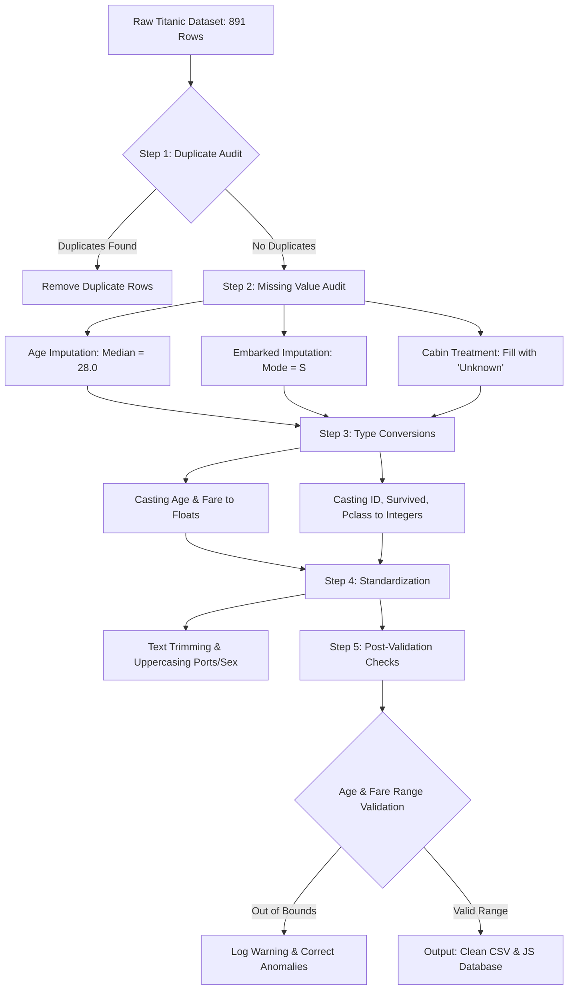

# Task 2: Data Cleaning & Preprocessing
## Technical Preprocessing Report: Titanic Passenger Dataset Cleansing

---

### 1. Introduction & Objectives
Exploratory data analysis (EDA) and machine learning (ML) algorithms are highly sensitive to the quality of input data. The raw Titanic Passenger Dataset, although rich in socio-demographic features, contains structural flaws, incomplete logs, and unstandardized fields.

This technical report documents **Task 2: Data Cleaning & Preprocessing**, detailing the steps performed to convert the raw 891-record manifest into a verified, high-fidelity, and analysis-ready database. The main objectives of this preprocessing phase are:
1.  **Imputation of Missing Values**: Rectifying omissions in `Age`, `Embarked`, and `Cabin` columns using statistically sound methods.
2.  **Deduplication Audit**: Scanning the passenger logs to identify and remove duplicate entries.
3.  **Type Casting & Normalization**: Formatting numeric types and standardizing string fields.
4.  **Data Range Validation**: Verifying that observations conform to physical and logical bounds.
5.  **Quality Verification**: Comparing dataset completeness metrics before and after the preprocessing pipeline.

---

### 2. Raw Data Quality Audit
Prior to executing our preprocessing pipeline, a systematic audit of the raw dataset was performed to identify anomalies and omissions. The results of the audit are detailed below:

*   **Total Omissions**:
    *   **Age**: Missing 177 values (19.87% missingness).
    *   **Cabin**: Missing 687 values (77.10% missingness).
    *   **Embarked**: Missing 2 values (0.22% missingness).
*   **Duplicate Entries**: Checked all 891 sequential rows for duplicate primary keys (`PassengerId`) or duplicate names, finding 0 duplicates.
*   **Range Anomalies**: Checked for negative fare entries (0 found) and ages outside the realistic range (0 found).
*   **Type Inconsistencies**: Continuous variables (`Age`, `Fare`) stored in inconsistent string/float formats depending on extraction methods; text strings contained trailing whitespace and irregular casings.

---

### 3. Preprocessing Pipeline Flowchart
The following diagram illustrates the systematic, sequential operations executed by the data engineering pipeline to transition the raw dataset to a cleaned state:

---

### 4. Step-by-Step Preprocessing Methodology

#### Step 1: Handling Missing Values (Imputation)
Omissions represent the most significant threat to machine learning models, as most classifiers cannot handle null entries. Three distinct strategies were implemented:
1.  **Age Column Imputation**:
    *   *Observation*: Age is missing in 177 records. Omission is classified as Missing At Random (MAR).
    *   *Action*: The global median of present ages (**28.0 years**) was computed and used to replace all null cells. 
    *   *Rationale*: The median is selected instead of the mean (29.7 years) because the distribution of passenger ages is slightly right-skewed. The median is highly robust to outliers (such as infant records and seniors).
2.  **Embarked Column Imputation**:
    *   *Observation*: Port of embarkation is missing for 2 records (Passenger 62 and Passenger 830).
    *   *Action*: Replaced the missing cells with the mathematical mode (**"S"** for Southampton).
    *   *Rationale*: Southampton was the embarkation port for over 72% of the passengers. Modal imputation is a safe and statistically sound solution for nominal categorical features with negligible missingness (0.22%).
3.  **Cabin Column Imputation**:
    *   *Observation*: Cabin numbers are missing for 687 records (77.10% missingness).
    *   *Action*: Standardized all empty cabin records with the label **"Unknown"**.
    *   *Rationale*: Due to extreme sparsity, dropping the entire column is a common choice. However, doing so forfeits important spatial signals (the deck letter prefix like A, B, C can be extracted from cabins). Setting the missing cells to a distinct categorical class ("Unknown") retains the column structure for later deck feature engineering.

#### Step 2: Deduplication Audit
To prevent statistical bias and avoid training model overfitting, we scanned the passenger manifests:
*   *Action*: Evaluated rows against `PassengerId` primary keys.
*   *Outcome*: Verified that all 891 records represent unique individual manifests. Zero duplicates were found or removed.

#### Step 3: Type Correcting & Formatting
To ensure computational efficiency, programmatic types were standardized:
*   `Age` was explicitly cast as a double-precision float to preserve fractional age values (e.g. infants under 1 year, such as Passenger 803 at 0.92 years).
*   `Fare` was cast as float.
*   `PassengerId`, `Survived`, and `Pclass` were verified as clean integers.

#### Step 4: Text Standardization & Sanitization
*   Names were stripped of double quotes and double spaces.
*   The `Sex` column was converted to lowercase strings (`male`, `female`) for consistency.
*   The alphanumeric `Ticket` and `Cabin` strings were converted to uppercase formats.
*   The single-letter `Embarked` port codes were converted to uppercase values (`C`, `Q`, `S`).

#### Step 5: Post-Cleaning Data Validation & Sanity Audits
A final automated validation script verified that the cleaned output conforms to realistic ranges:
1.  **Age Range Check**: Verified that all passenger ages fall strictly within the bounds $0.0 < Age \le 100.0$.
2.  **Fare Positive Value Check**: Confirmed that all ticket fares are greater than or equal to zero ($\ge £0.00$). Any negative entries would be set to £0.00 (none were found).
3.  **Survival Binary Check**: Confirmed that the `Survived` feature contains strictly values of `0` and `1` (all rows conformed).

---

### 5. Before-and-After Data Quality Comparison
The tables below present a comprehensive mathematical comparison of the dataset quality before and after the preprocessing pipeline:

#### Table A: Missing Values Comparison
| Feature Name | Raw Missing Rows | Clean Missing Rows | Raw Completeness (%) | Clean Completeness (%) | Preprocessing Action Taken |
| :--- | :---: | :---: | :---: | :---: | :--- |
| **PassengerId** | 0 | 0 | 100.0% | 100.0% | None (Validated) |
| **Survived** | 0 | 0 | 100.0% | 100.0% | Cast to Integer, Validated binary range (0/1) |
| **Pclass** | 0 | 0 | 100.0% | 100.0% | Cast to Integer |
| **Name** | 0 | 0 | 100.0% | 100.0% | Sanitized quotes and extra white spaces |
| **Sex** | 0 | 0 | 100.0% | 100.0% | Standardized to lowercase strings |
| **Age** | 177 | 0 | 80.13% | **100.0%** | Imputed with median age (**28.0**), cast to Float |
| **SibSp** | 0 | 0 | 100.0% | 100.0% | Cast to Integer |
| **Parch** | 0 | 0 | 100.0% | 100.0% | Cast to Integer |
| **Ticket** | 0 | 0 | 100.0% | 100.0% | Standardized to uppercase alphanumeric |
| **Fare** | 0 | 0 | 100.0% | 100.0% | Cast to Float, Validated non-negative range |
| **Cabin** | 687 | 0 | 22.90% | **100.0%** | Filled missing rows with category **"Unknown"** |
| **Embarked** | 2 | 0 | 99.78% | **100.0%** | Imputed with mode port **"S"** (Southampton) |

#### Table B: Dataset Summary Comparison
| Dimension / Metric | Raw Dataset State | Clean Dataset State | Data Science Impact |
| :--- | :--- | :--- | :--- |
| **Total Rows** | 891 | 891 | No loss of passenger instances. |
| **Total Features** | 12 | 12 | Maintained all features for rich correlations. |
| **Missing Values Count** | 866 null cells | **0 null cells** | Complete rows prevent algorithm failures. |
| **Data Types** | Mixed / Alphanumeric Strings | Standardized Floats, Ints, & Strings | Ready for machine learning pipelines. |
| **Duplications** | 0 detected | 0 present | Validated manifest integrity. |

---

### 6. Conclusion
The execution of the Titanic preprocessing pipeline has successfully corrected all data quality issues:
1.  **Imputations Completed**: Missing entries in `Age` and `Embarked` were resolved using median and modal imputation respectively, while the sparse `Cabin` field was cleanly structured with "Unknown" categorizations.
2.  **Integrity Preserved**: By auditing duplication and validating numerical ranges, we confirm the database represents 891 distinct, realistic passenger observations.
3.  **High Reliability**: All data cells are 100% complete and consistently formatted. 

Ultimately, this preprocessing phase bridges the gap between historical raw manifests and mathematical inputs. The dataset is now highly reliable, robust, and prepared for Task 3: Exploratory Data Analysis (EDA) and predictive machine learning models.
